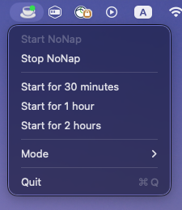

# NoNap ☕

[](https://github.com/barvhaim/nonap/actions/workflows/build.yml)

A native macOS menu bar app that keeps your Mac awake **only when you need it**.

Use it for long builds, downloads, backups, SSH sessions, local AI jobs, and
anything else that should not be interrupted by sleep. It's the GUI equivalent
of the `caffeinate` command.

<p align="center">
  
</p>

## Menu

```
☕ NoNap: Active

Start NoNap
Stop NoNap
Start for 30 minutes
Start for 1 hour
Start for 2 hours
──────────────
Mode ▸
  ✓ Prevent system sleep      (default — like `caffeinate`)
    Prevent display sleep
    Prevent both
──────────────
Quit
```

- **Prevent system sleep** — the Mac stays awake; the display may still sleep.
- **Prevent display sleep** — the screen stays on too.
- **Prevent both** — neither the system nor the display sleeps.

The selected mode is remembered across launches. Timed sessions show a live
countdown in the menu bar and stop automatically when they expire.

## How it works

NoNap holds IOKit power assertions
(`kIOPMAssertionTypePreventUserIdleSystemSleep` /
`…PreventUserIdleDisplaySleep`) — the same mechanism `caffeinate` uses. No
background daemons, no polling. Assertions are released the moment you Stop or
Quit.

## Build & run

Requires Xcode / Swift 6 toolchain on macOS.

```bash
# Fast dev loop — runs as a menu-bar accessory, no Dock icon:
swift run

# Build a distributable NoNap.app and launch it:
./Scripts/make_app.sh
open ./NoNap.app
```

## Sharing NoNap with others

```bash
./Scripts/package_zip.sh      # builds NoNap.app and zips it to NoNap.zip
```

Send `NoNap.zip` to anyone. Because the app is **ad-hoc signed** (not notarized
by Apple), macOS Gatekeeper will block a plain double-click on another Mac. The
recipient opens it the first time by either:

- **Right-click `NoNap.app` → Open → Open** (only needed once), or
- Running `xattr -dr com.apple.quarantine /path/to/NoNap.app` in Terminal.

After that it launches normally. This is the free, no-Apple-account path and is
fine for yourself and a handful of friends.

> **Want clean, warning-free distribution to anyone?** That requires an Apple
> Developer account ($99/yr) to sign with a *Developer ID* certificate and
> notarize the app. The signing/notarization step can be added to the build
> script when you're ready — NoNap needs no special entitlements, so it's
> straightforward.

This build is **Apple Silicon (arm64) only**. For Intel Macs, build a universal
binary with `swift build -c release --arch arm64 --arch x86_64`.

## Verify it's working

While NoNap is active:

```bash
pmset -g assertions
```

You should see `PreventUserIdleSystemSleep` (and/or `PreventUserIdleDisplaySleep`)
attributed to NoNap. They disappear when you Stop or Quit.

## Contributing

Issues and pull requests are welcome. To hack on NoNap:

```bash
git clone <your-fork-url>
cd nonap
swift run          # runs the menu-bar app directly, no Dock icon
```

The whole app is four small Swift files under `Sources/NoNap/`.

## License

[MIT](LICENSE) © barvhaim
